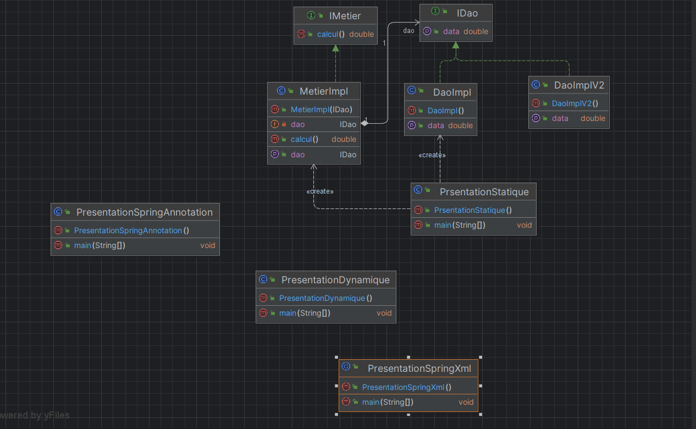
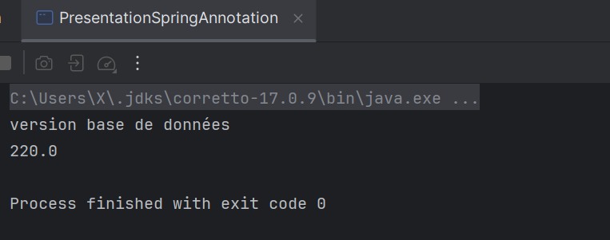
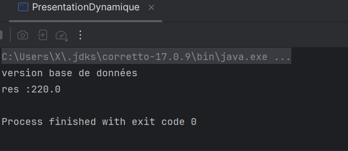
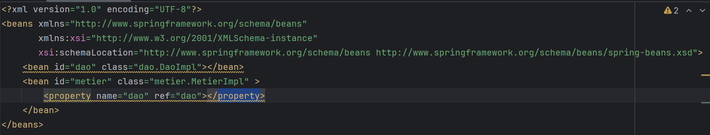
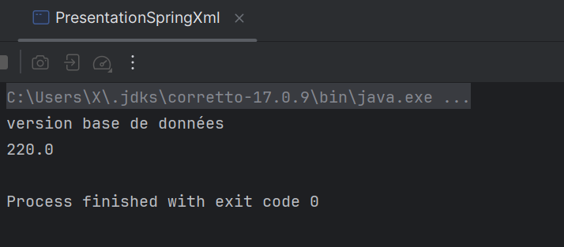
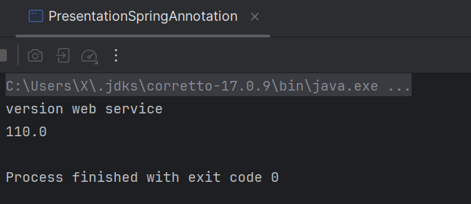

<h2>Injection des dépendances et Inversion de contrôle</h2>

Dans ce projet, nous explorons les concepts d'injection de dépendances et d'inversion de contrôle en utilisant différentes méthodes :

<ul>
  <li>Injection Statique</li>
  <li>Injection Dynamique</li>
  <li>Injection via Spring XML</li>
  <li>Injection via Annotations Spring</li>
</ul>

<h2>Captures d'écran des tests</h2>

Voici les captures d'écran des résultats des tests :

<ul>
  <li><strong>Injection Statique</strong></li>
  

  <li><strong>Injection Dynamique</strong></li>
  

  <li><strong>Injection via Spring XML</strong></li>
  
Le fichier de configuration Spring XML ci-dessus contient la configuration des beans utilisée pour l'injection via Spring XML.

  
    
  Test réalisé 

  

  <li><strong>Injection via Annotations Spring</strong></li>
  
</ul>

